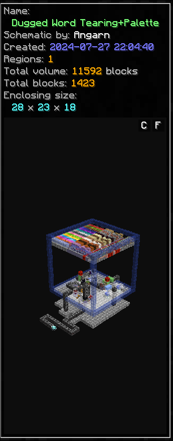
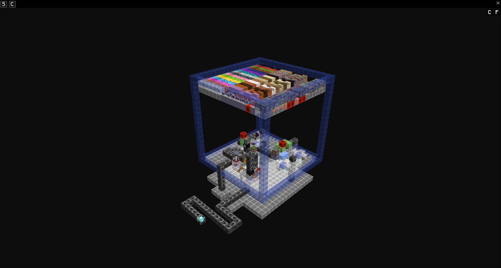
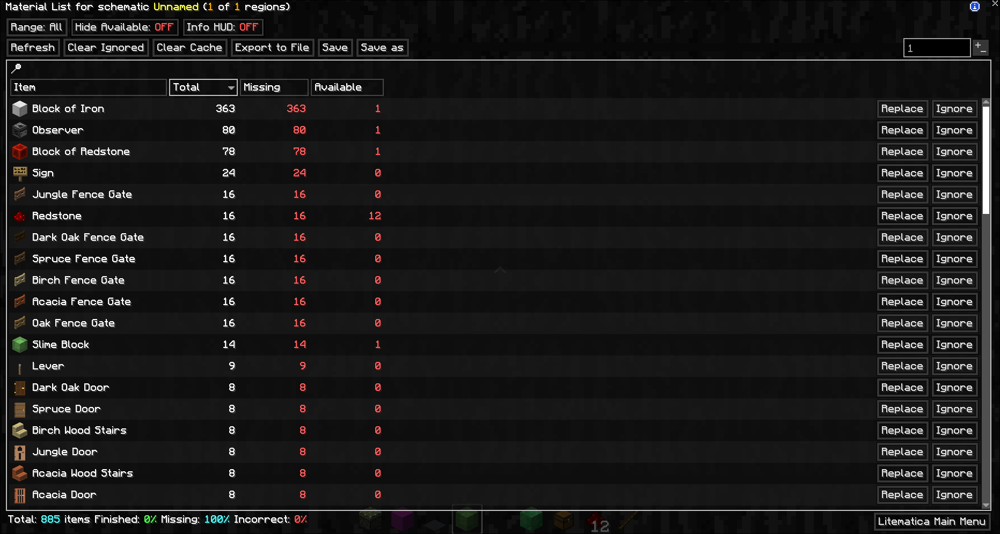

# SchematicPreview for LiteLoader 1.12.2

A [Litematica](https://github.com/maruohon/litematica) addon for Minecraft 1.12.2 /
[LiteLoader](https://www.liteloader.com/) that brings the features of the Fabric mod
[DimasKama/SchematicPreview](https://github.com/DimasKama/SchematicPreview) to 1.12.2,
re-implemented from scratch:

- **Schematic previews** — live 3D preview of the selected schematic in the browser side
  panel (drag to rotate, scroll to zoom, fullscreen and free-camera modes) and small previews
  per entry in list or 3/4/5-column tile layouts.
- **Directory icons** — right-click a folder to give it any item as icon.
- **Replace button** in the material list — swap every block of one type in the schematic.

- **Save / Save as** in the material list — write a schematic edited with Replace back to
  disk (overwrite or new file) without loading or placing it first.
- **Open schematics folder** button in Litematica's main menu — opens the schematics
  directory in your file manager.

## Screenshots

<!-- Drop PNGs into docs/images/ with these names; the table renders once they exist. -->

| Browser side panel | Fullscreen preview |
|---|---|
|  |  |

| Material list with Replace / Save / Save as |
|---|
|  |

<!-- Wanted: docs/images/tiles.png — the browser in a tile layout (preview-type button). -->

## Usage

- **Config screen:** `Right Shift + F8` (rebindable) or LiteLoader's mod panel. Tabs Generic /
  Menu / Preview / Hotkeys.
- **Preview:** select a schematic in any Litematica browser. Drag = rotate, scroll = zoom,
  the two buttons in the preview's corner open **fullscreen** and toggle **freecam** (in
  freecam, drag pans instead of orbiting). Fullscreen has **Save PNG** and **Copy** buttons
  (Wayland desktops need `wl-copy` on PATH for Copy).
- **Preview type:** the grid button next to the browser's path bar cycles List / List preview /
  Tile 5 / 4 / 3 columns (right-click cycles backwards). Tile and list previews are skipped for
  schematics above `previewMaxVolume` blocks (default 125 000).
- **Directory icons:** right-click a folder's icon in the browser, type an item id
  (`minecraft:diamond_block`), pick a position. Stored in `config/schematicpreview_icons.json`.
- **Replace:** open a material list (browser → *Material list*, or Loaded Schematics), click
  **Replace** on a row, pick a block. Keeps orientation properties the two blocks share.
- **Save / Save as:** in a schematic-backed material list, next to *Export*. *Save* overwrites
  the file after a confirmation; *Save as* asks for a name and never overwrites.
- **Open schematics folder:** in Litematica's main menu, under *Configuration menu*. Opens
  the folder Litematica loads schematics from (`schematics/` in the game directory).

Task history and design notes: `PLAN.md`, `AGENTS.md`, `docs/port-design.md`.

## Requirements (runtime)

| Mod | Version |
|-----|---------|
| Minecraft | 1.12.2 |
| LiteLoader | 1.12.2 |
| MaLiLib (LiteLoader) | 0.53.0 or 0.54.0 |
| Litematica (LiteLoader) | 0.31.4 |

MaLiLib and Litematica for 1.12.2 are on [masa's download page](https://masa.dy.fi/mcmods/client_mods/?mcver=1.12.2),
[Modrinth](https://modrinth.com/mod/litematica/version/0.31.4) and CurseForge.

## Building

Toolchain is the same as Litematica 1.12.2: ForgeGradle 2.3 + Gradle 2.14.1 wrapper, **JDK 8**.

```bash
python3 tools/setup-build-deps.py    # once: fetches a pinned JDK 8 into .jdk-cache/ and
                                      # litematica's .litemod (repacked) into libs/
export JAVA_HOME=$PWD/.jdk-cache/jdk8u302-b08

./gradlew build                  # first run is slow: downloads + deobfuscates MC 1.12.2
                                  # → build/libs/schematicpreview-liteloader-1.12.2-<version>.litemod
./gradlew runClient              # dev client, run dir ./minecraft
```

**Use the pinned JDK, not your system's JDK 8** if it's a recent build (8u402+): ForgeGradle
2.3's deobfuscator hits a real `java.util.zip.ZipException` on newer JDK 8 point releases.
See `AGENTS.md` → Gotchas for why, and `tools/setup-build-deps.py` for the fix.

Litematica LiteLoader isn't published to a Maven repo, hence the script — it downloads
`litematica-liteloader-1.12.2-<version>.litemod` from
[masa's mod page](https://masa.dy.fi/mcmods/litematica/) and repacks it. Alternative: build
Litematica from source (`maruohon/litematica`, branch `liteloader_1.12.2`, commit `1db931a6`)
and publish it to your local Maven.

## License

[LGPL-3.0](LICENSE), same as Litematica and MaLiLib. This is a clean-room reimplementation:
the original Fabric mod is "All rights reserved" and no code or assets from it are used here.
